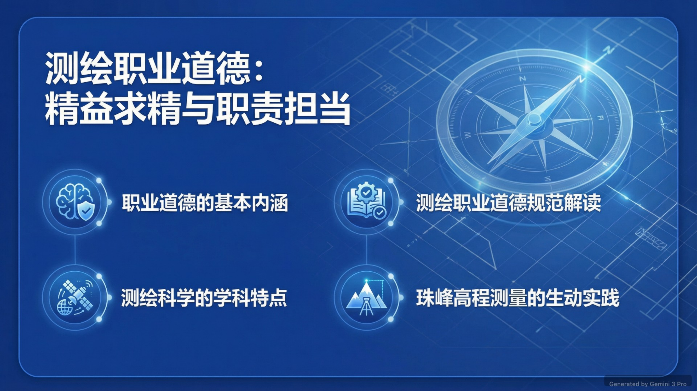
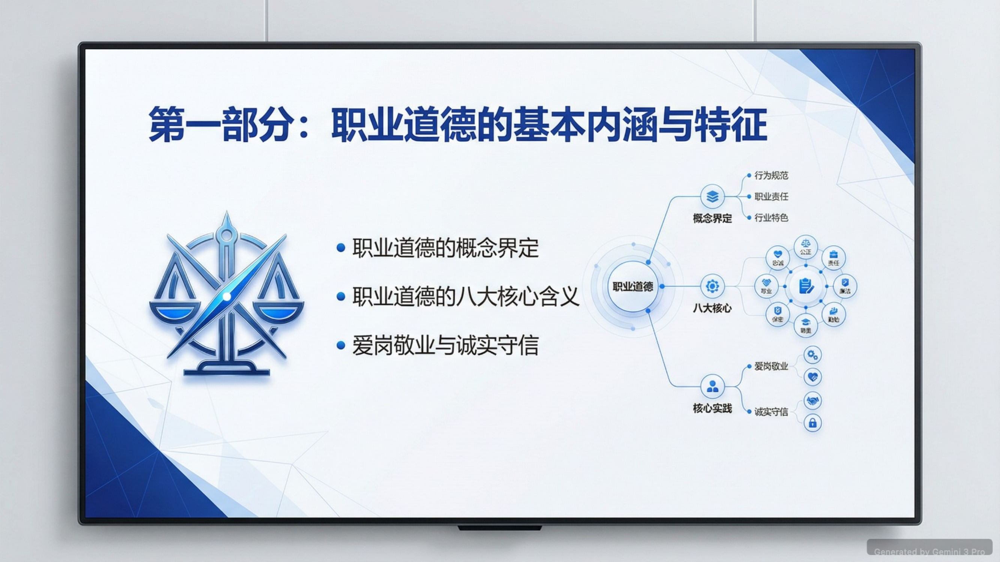
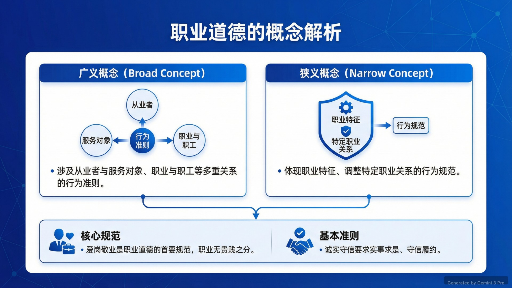
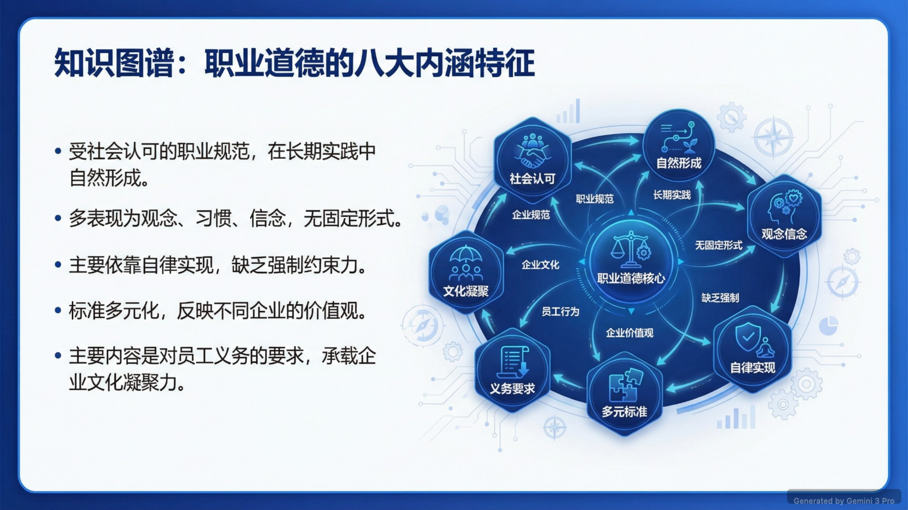
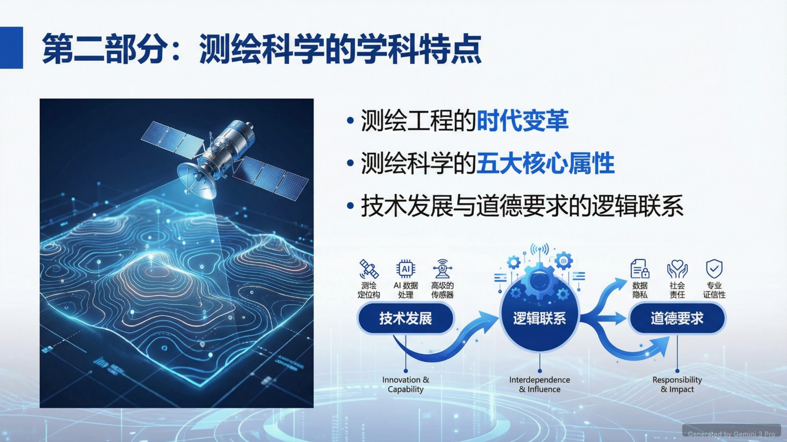
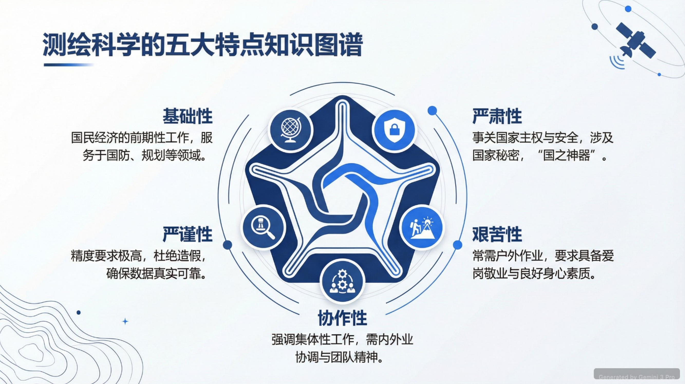

<div align="center">


# 🎨 AI PPT Master | 智能PPT工作台

<p>
  
  
  
  
</p>

**类似 NotebookLM 的 AI 演示文稿生成工具，但更灵活可控**  
*Like NotebookLM's PPT generator, but with fine-grained control over every slide*

[English](#english) | [中文](#中文)

---

</div>

## 中文

### 📖 项目简介

AI PPT Master 是一款**类似 Google NotebookLM PPT 生成器**的智能演示文稿工具，基于 Google Gemini 3 Pro 构建。与 NotebookLM 相比，本工具提供了**更精细的控制能力**：

#### 🆚 与 NotebookLM 的对比

| 功能 | NotebookLM | AI PPT Master |
|------|-----------|---------------|
| AI 生成内容 | ✅ | ✅ |
| **自定义页数** | ❌ 固定生成 | ✅ **1-70 页可调** |
| **单页编辑** | ❌ 整体生成 | ✅ **独立调整每页 Prompt** |
| **不满意重生成** | ❌ 需重新生成全部 | ✅ **单页重新生成** |
| 主题定制 | ❌ 有限 | ✅ 5 种专业主题 |
| 本地部署 | ❌ 云端服务 | ✅ 可本地运行 |
| 数据隐私 | ❌ 上传至 Google | ✅ 仅本地存储 API Key |

**🔗 在线体验**：[AI Studio App](https://ai.studio/apps/drive/1IV3cEZQ12qAZ7jN3Lsem-Kdg6nFYwh30)

---

### 🎬 实际案例展示

#### 案例：《测绘职业道德：精益求精与职责担当》

一份使用本工具生成的14页专业培训演示文稿，展示了AI在教育培训领域的应用。

<div align="center">
  
**封面页 - 专业设计风格**


**章节页 - 清晰的内容导航**


</div>

<details>
<summary>📄 <b>点击查看更多幻灯片</b></summary>

<br>

**职业道德概念解析 - 双维度展示**


**八大内涵特征 - 知识图谱**


**学科特点 - 图文并茂**


**五大特点详解 - 专业信息图**


</details>

<br>

**📊 生成参数：**
- 主题：测绘职业道德教育
- 页数：14 页
- 主题配色：商务深蓝
- 生成时间：约 2 分钟

**✨ 生成亮点：**
- ✅ **专业术语准确**：GNSS卫星定位、重力仪、5G通讯等专业概念理解准确
- ✅ **结构逻辑清晰**：概念界定 → 学科特点 → 职业规范 → 实践案例（珠峰测量）
- ✅ **图表丰富美观**：知识图谱、流程图、六边形布局、信息图表
- ✅ **真实案例结合**：2020年珠峰高程测量（8848.86米）作为实践案例
- ✅ **中文排版专业**：针对中文内容优化，无乱码，排版美观

**[📥 下载完整PDF](./screenshots/case-surveying-ethics.pdf)**

---

### ✨ 核心特性

#### 🎯 精准控制
- **📊 灵活页数**：支持生成 **1-70 页**演示文稿（NotebookLM 无法指定页数）
- **✏️ 单页编辑**：每一页的标题、内容、配图提示词都可以独立修改
- **🔄 智能重生成**：对某一页不满意？单独重新生成该页，无需重做整个 PPT
- **🎨 逐页定制**：为每页单独调整 AI Prompt，生成更符合需求的内容

#### 🤖 AI 智能生成
- 基于 Gemini 3 Pro，理解复杂需求，生成高质量内容
- 自动生成演讲者备注（Speaker Notes）
- 智能分页：自动划分封面、章节、内容页和总结页

#### 🎨 专业主题系统
- **商务深蓝**：企业汇报、商业计划
- **翡翠森系**：环保、可持续发展
- **极简黑白**：设计作品、技术分享
- **科技紫韵**：科技产品、创新项目
- **活力暖橙**：市场营销、创意提案

#### 📄 强大导出功能
- 支持 **PDF** 和 **PPTX** 格式导出
- PPTX 文件可在 PowerPoint/Keynote 中继续编辑

#### 🔒 隐私与安全
- API Key 仅存储在本地浏览器 LocalStorage
- 所有请求直接发送至 Google 服务器，不经过任何第三方
- 可完全离线部署（配置好 API Key 后）

---

### 🛠️ 技术栈

| 类别 | 技术 |
|------|------|
| **前端框架** | React 19.2.3 + TypeScript 5.8.2 |
| **构建工具** | Vite 6.2.0 |
| **样式方案** | Tailwind CSS (CDN) |
| **AI 模型** | Google Gemini 3 Pro API |
| **导出库** | pptxgenjs (PPTX), jsPDF + html2canvas (PDF) |
| **其他** | lucide-react (图标), pdfjs-dist, mammoth |

---

### 🚀 快速开始

#### 前置要求
- Node.js 18+
- npm 或 yarn
- Google Gemini API Key ([免费获取](https://aistudio.google.com/app/apikey))

#### 安装运行

```bash
# 1. 克隆仓库
git clone https://github.com/Freyaaa001/auto-ppt-tool.git
cd auto-ppt-tool

# 2. 安装依赖
npm install

# 3. 启动开发服务器
npm run dev

# 4. 访问应用
# 打开浏览器访问 http://localhost:3000
```

#### 生产构建

```bash
npm run build
npm run preview
```

---

### 📝 使用说明

#### 第一步：配置 API Key
1. 访问 [Google AI Studio](https://aistudio.google.com/app/apikey) 获取免费 API Key
2. 在应用首页输入 API Key
3. 点击"测试连接"验证有效性
4. 点击"进入工作台"

> 💡 **提示**：API Key 仅存储在您的浏览器本地，绝不上传到任何服务器

#### 第二步：生成演示文稿
1. **输入主题**：如 "人工智能在医疗领域的应用"
2. **选择主题配色**：5 种专业主题任选
3. **设置页数**：**1-70 页自由指定**（推荐 10-25 页）
4. 点击"生成大纲"

#### 第三步：精细化编辑（核心优势）

##### ✏️ 编辑单页内容
- 点击任意幻灯片进入编辑模式
- 修改标题、副标题、内容要点
- 编辑演讲者备注
- 调整配图提示词

##### 🔄 重新生成单页
- **场景**：某一页生成效果不理想
- **操作**：点击"重新生成"按钮
- **优势**：无需重做整个 PPT，只重新生成当前页
- **自定义 Prompt**：可以修改该页的生成指令，获得更精准的内容

##### 🎨 生成 AI 配图提示词
- 点击"生成配图提示词"
- AI 自动分析该页内容，生成适合的图片描述
- 可复制到 Midjourney、DALL-E 等工具生成图片

#### 第四步：导出文件
- **导出 PDF**：保留排版和样式，适合分享和打印
- **导出 PPTX**：可在 PowerPoint/Keynote 中继续编辑

---

### 💡 使用场景示例

#### 场景 1：学术汇报（30 页）
```
主题：深度学习在自然语言处理中的应用
页数：30 页
操作：
1. 生成初始大纲
2. 发现第 5 页"Transformer 架构"内容过于简单
3. 单独重新生成第 5 页，添加更多技术细节
4. 为第 10-15 页（模型对比章节）生成配图提示词
5. 导出为 PPTX，在 PowerPoint 中添加实验图表
```

#### 场景 2：商业提案（15 页）
```
主题：智能客服系统商业计划书
页数：15 页
操作：
1. 使用"商务深蓝"主题生成大纲
2. 第 8 页"市场分析"数据不够新
3. 修改该页 Prompt："2024 年最新的客服市场规模数据"
4. 重新生成第 8 页
5. 导出为 PDF 用于投资人演示
```

#### 场景 3：教学课件（50 页）
```
主题：Python 编程入门课程
页数：50 页
操作：
1. 生成完整课程大纲
2. 逐章检查，对不满意的页面单独重生成
3. 为代码示例页面添加详细的演讲者备注
4. 导出为 PPTX 供学生下载
```

---

### 📂 项目结构

```
auto-ppt-tool/
├── components/              # React 组件
│   ├── PPTWorkbench.tsx    # 主工作台（核心编辑界面）
│   ├── SlidePreview.tsx    # 幻灯片预览组件
│   ├── SlideEditor.tsx     # 单页编辑器（支持单页重生成）
│   └── ...
├── services/               # 服务层
│   └── geminiService.ts    # Gemini API 封装
├── screenshots/            # 案例截图
│   ├── case-surveying-*.png
│   └── case-surveying-ethics.pdf
├── App.tsx                 # 应用入口（API Key 管理）
├── types.ts                # TypeScript 类型定义
│                           # - SlideData (幻灯片数据结构)
│                           # - PresentationConfig (配置)
│                           # - AppTheme (主题系统)
├── vite.config.ts          # Vite 配置
└── package.json            # 项目依赖
```

---

### 🎓 技术实现亮点

#### 1. 灵活的页数控制
```typescript
// types.ts
export interface PresentationConfig {
  themeColor: string;
  targetSlideCount: number; // 1-70 页可调
}
```

#### 2. 单页重生成机制
```typescript
// geminiService.ts 核心逻辑
export async function regenerateSlide(
  slideId: string, 
  customPrompt?: string
) {
  // 只重新生成指定的单页
  // 保持其他页面不变
  const prompt = customPrompt || generateDefaultPrompt(slideId);
  return await geminiAPI.generateContent(prompt);
}
```

#### 3. 独立的 Prompt 调整
- 每页的 `speakerNotes` 字段存储自定义 Prompt
- 用户可随时修改 Prompt 并重新生成
- 实现真正的"所见即所得"精细控制

#### 4. 主题系统
```typescript
// 5 种预设主题，支持自定义配色
export const THEMES: AppTheme[] = [
  { id: 'corporate-blue', name: '商务深蓝', colors: {...} },
  { id: 'emerald-growth', name: '翡翠森系', colors: {...} },
  // ...
];
```

---

### 🔐 隐私与安全

- ✅ **API Key 本地存储**：仅保存在浏览器 LocalStorage
- ✅ **无中间服务器**：请求直接发送至 Google API
- ✅ **开源透明**：代码完全公开，可自行审查
- ✅ **可离线部署**：配置后可在本地网络运行
- ⚠️ **使用建议**：不要在公共设备保存 API Key

---

### 🚧 未来计划

- [ ] 支持上传文档（PDF/Word/Markdown）自动生成 PPT
- [ ] 集成 AI 图片生成 API（Stable Diffusion/DALL-E）
- [ ] 支持导入现有 PPT 进行 AI 优化
- [ ] 添加幻灯片动画效果配置
- [ ] 支持团队协作（多人同时编辑）
- [ ] 多语言界面（English, 日本語）
- [ ] 移动端 App 版本

---

### 🤝 贡献指南

欢迎提交 Issue 和 Pull Request！

1. Fork 本仓库
2. 创建特性分支 (`git checkout -b feature/AmazingFeature`)
3. 提交更改 (`git commit -m 'feat: add amazing feature'`)
4. 推送到分支 (`git push origin feature/AmazingFeature`)
5. 提交 Pull Request

**贡献建议**：
- 新增主题配色方案
- 优化 AI Prompt 模板
- 改进导出功能（支持更多格式）
- 添加单元测试

---

### 📄 许可证

MIT License - 详见 [LICENSE](LICENSE) 文件

---

### 👨‍💻 作者

**Freya** - Mathematics & AI Enthusiast

- GitHub: [@Freyaaa001](https://github.com/Freyaaa001)
- 领域：数学、机器学习、AI产品开发

---

### 🙏 致谢

- [Google Gemini](https://ai.google.dev/) - 提供强大的 AI 能力
- [NotebookLM](https://notebooklm.google/) - 灵感来源
- [React](https://react.dev/) - 优秀的前端框架
- [pptxgenjs](https://gitbrent.github.io/PptxGenJS/) - PPTX 生成库

---

## English

### 📖 Introduction

AI PPT Master is an intelligent presentation generator **similar to Google NotebookLM's PPT feature**, powered by Google Gemini 3 Pro. However, it offers **much more control and flexibility**:

#### 🆚 Comparison with NotebookLM

| Feature | NotebookLM | AI PPT Master |
|---------|-----------|---------------|
| AI Generation | ✅ | ✅ |
| **Custom Slide Count** | ❌ Fixed | ✅ **1-70 slides** |
| **Edit Individual Slides** | ❌ All or nothing | ✅ **Per-slide prompt control** |
| **Regenerate Single Slide** | ❌ Regenerate all | ✅ **Regenerate one slide** |
| Theme Customization | ❌ Limited | ✅ 5 professional themes |
| Local Deployment | ❌ Cloud only | ✅ Self-hostable |
| Privacy | ❌ Data uploaded | ✅ Local API key storage |

**🔗 Try it online**: [AI Studio App](https://ai.studio/apps/drive/1IV3cEZQ12qAZ7jN3Lsem-Kdg6nFYwh30)

---

### 🎬 Real-World Example

#### Case Study: "Surveying Professional Ethics" (14 slides)

A professionally generated training presentation showcasing AI application in education.

<div align="center">
  
**Cover Slide - Professional Design**


**Section Slide - Clear Navigation**


</div>

<details>
<summary>📄 <b>View More Slides</b></summary>

<br>

**Concept Analysis - Dual Perspective**


**Eight Core Characteristics - Knowledge Map**


**Discipline Features - Illustrated**


**Five Key Attributes - Professional Infographic**


</details>

<br>

**📊 Generation Parameters:**
- Topic: Surveying Professional Ethics Training
- Slides: 14 pages
- Theme: Corporate Blue
- Time: ~2 minutes

**✨ Highlights:**
- ✅ **Accurate Technical Terms**: GNSS, gravimeter, 5G communication
- ✅ **Logical Structure**: Concept → Features → Standards → Case Study (Mt. Everest)
- ✅ **Rich Visuals**: Knowledge maps, flowcharts, hexagonal layouts, infographics
- ✅ **Real-World Case**: 2020 Mt. Everest Height Measurement (8848.86m)
- ✅ **Chinese Typography**: Optimized for Chinese content, professional layout

**[📥 Download Full PDF](./screenshots/case-surveying-ethics.pdf)**

---

### ✨ Key Features

#### 🎯 Fine-Grained Control
- **📊 Flexible Length**: Generate **1-70 slides** (NotebookLM can't specify count)
- **✏️ Per-Slide Editing**: Edit title, content, speaker notes independently
- **🔄 Smart Regeneration**: Unhappy with slide 5? Regenerate only that slide
- **🎨 Custom Prompts**: Adjust AI prompt for each slide individually

#### 🤖 AI-Powered Generation
- Powered by Gemini 3 Pro for high-quality content
- Auto-generates speaker notes
- Smart pagination: covers, sections, content, and end slides

#### 🎨 Professional Themes
- Corporate Blue, Emerald Green, Minimal Gray, Tech Purple, Warm Orange

#### 📄 Export Options
- **PDF**: Preserves layout and styling
- **PPTX**: Editable in PowerPoint/Keynote

#### 🔒 Privacy First
- API keys stored locally in browser only
- Direct communication with Google servers
- No third-party servers involved

---

### 🚀 Quick Start

#### Prerequisites
- Node.js 18+
- npm or yarn
- Google Gemini API Key ([Get free key](https://aistudio.google.com/app/apikey))

#### Installation

```bash
# Clone repository
git clone https://github.com/Freyaaa001/auto-ppt-tool.git
cd auto-ppt-tool

# Install dependencies
npm install

# Start dev server
npm run dev

# Open http://localhost:3000
```

#### Build for Production

```bash
npm run build
npm run preview
```

---

### 📝 Usage Guide

#### Step 1: Configure API Key
1. Get free API key from [Google AI Studio](https://aistudio.google.com/app/apikey)
2. Enter API key on landing page
3. Test connection
4. Click "Enter Workbench"

#### Step 2: Generate Presentation
1. **Enter topic**: e.g., "AI Applications in Healthcare"
2. **Choose theme**: 5 professional options
3. **Set slide count**: **1-70 slides** (recommend 10-25)
4. Click "Generate Outline"

#### Step 3: Fine-Tune (Core Advantage)

##### ✏️ Edit Individual Slides
- Click any slide to enter edit mode
- Modify title, subtitle, content points
- Edit speaker notes
- Adjust image prompts

##### 🔄 Regenerate Single Slide
- **Scenario**: Slide 8's content isn't ideal
- **Action**: Click "Regenerate" button
- **Benefit**: No need to redo entire PPT
- **Custom Prompt**: Modify generation instructions for precise results

##### 🎨 Generate AI Image Prompts
- Click "Generate Image Prompt"
- AI analyzes slide content and creates image description
- Copy to Midjourney/DALL-E for image generation

#### Step 4: Export
- **Export PDF**: For sharing and printing
- **Export PPTX**: For further editing in PowerPoint

---

### 🛠️ Tech Stack

- **Frontend**: React 19.2.3 + TypeScript 5.8.2
- **Build Tool**: Vite 6.2.0
- **Styling**: Tailwind CSS (CDN)
- **AI Model**: Google Gemini 3 Pro API
- **Export**: pptxgenjs (PPTX), jsPDF + html2canvas (PDF)

---

### 📄 License

MIT License - see [LICENSE](LICENSE) file

### 👨‍💻 Author

**Freya** - Mathematics & AI Enthusiast  
GitHub: [@Freyaaa001](https://github.com/Freyaaa001)

---

### 🙏 Acknowledgments

- [Google Gemini](https://ai.google.dev/) - Powerful AI capabilities
- [NotebookLM](https://notebooklm.google/) - Inspiration
- [React](https://react.dev/) - Excellent frontend framework
- [pptxgenjs](https://gitbrent.github.io/PptxGenJS/) - PPTX generation

---

<div align="center">

**If this project helps you, please give it a ⭐️ Star!**

Made with ❤️ by Freya

</div>
